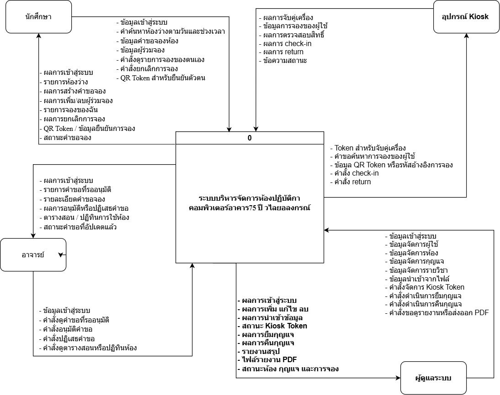
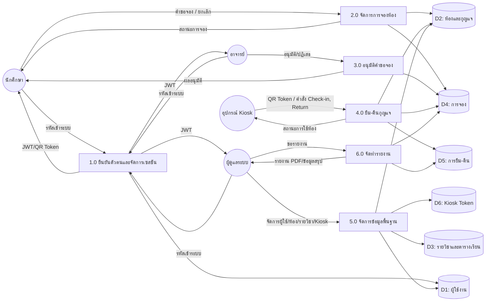
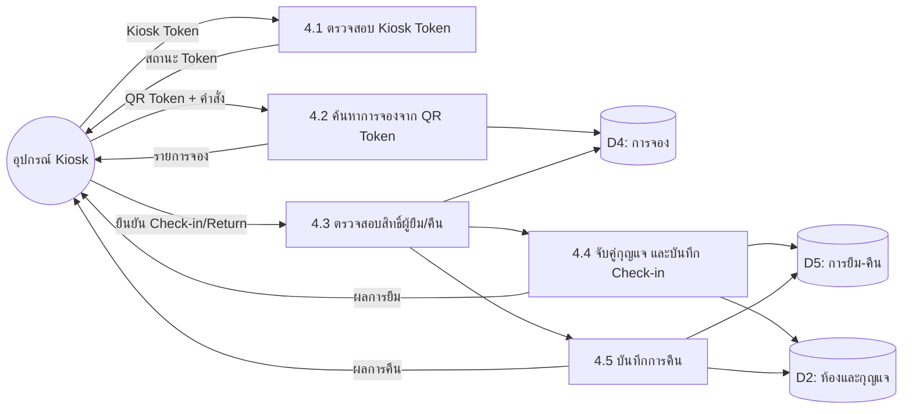
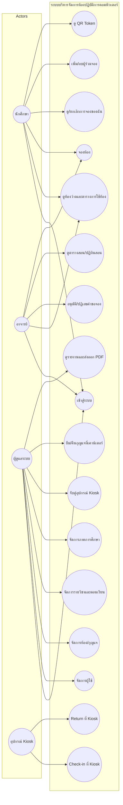
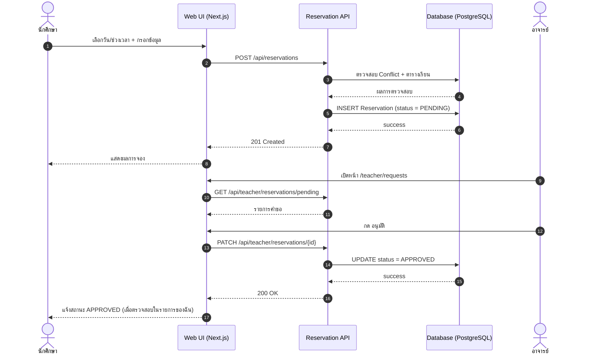
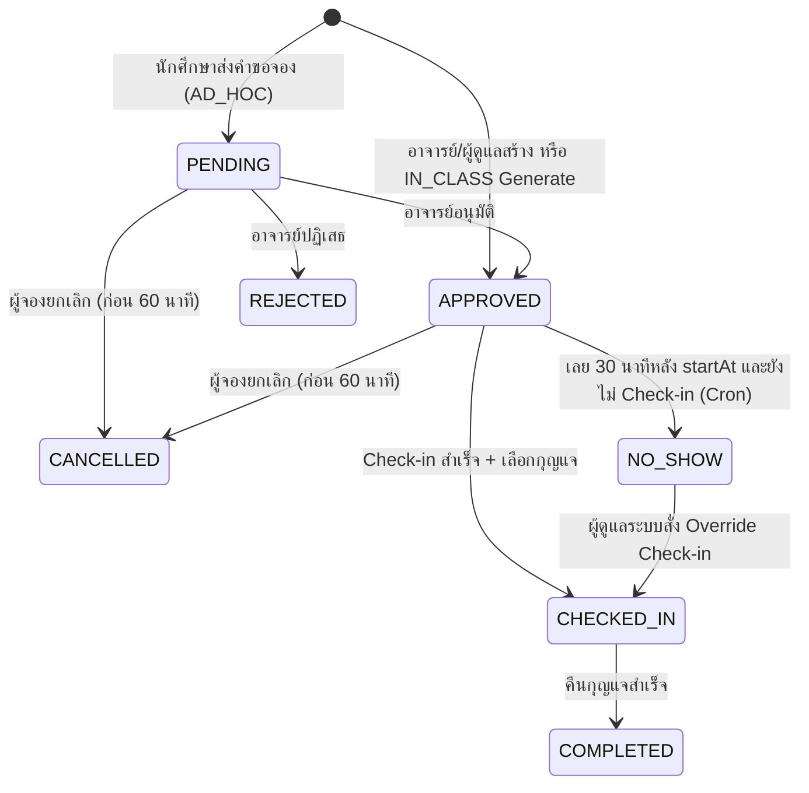

# บทที่ 3
# การวิเคราะห์และออกแบบระบบบริหารจัดการห้องปฏิบัติการคอมพิวเตอร์

บทนี้นำเสนอผลการวิเคราะห์และการออกแบบระบบบริหารจัดการห้องปฏิบัติการคอมพิวเตอร์ อาคาร 75 ปี วไลยอลงกรณ์ ผ่านการสแกนบัตรนักศึกษา ซึ่งครอบคลุมตั้งแต่ภาพรวมการไหลของข้อมูล (Context และ Data Flow Diagram) แผนภาพ E-R ของฐานข้อมูล กรณีการใช้งานของผู้ใช้แต่ละบทบาท แผนภาพลำดับการทำงานของกระบวนงานหลัก ตลอดจนการออกแบบส่วนนำเข้าข้อมูลและส่วนแสดงผล ทั้งนี้แผนภาพและรายละเอียดในบทนี้สอดคล้องกับขอบเขตของโครงงานที่กำหนดไว้ในข้อ 1.3

## 3.1  แผนภาพบริบท

แผนภาพบริบท (Context Diagram) แสดงภาพรวมของระบบและการสื่อสารกับสภาพแวดล้อมภายนอก โดยระบบกลางคือ **ระบบบริหารจัดการห้องปฏิบัติการคอมพิวเตอร์ อาคาร 75 ปี วไลยอลงกรณ์** ซึ่งสื่อสารกับเอนทิตีภายนอก 4 รายการ ได้แก่ นักศึกษา อาจารย์ ผู้ดูแลระบบ และอุปกรณ์ Kiosk ดังแสดงในรูปที่ 3.1



**รูปที่ 3.1**  แผนภาพบริบทระบบบริหารจัดการห้องปฏิบัติการคอมพิวเตอร์ อาคาร 75 ปี วไลยอลงกรณ์

จากรูปที่ 3.1 อธิบายข้อมูลที่ไหลเข้า-ออกของแต่ละเอนทิตีได้ดังนี้

**3.1.1  นักศึกษา (Student)**
- *ส่งเข้าระบบ:* ข้อมูลเข้าสู่ระบบ คำค้นหาห้องว่างตามวันและช่วงเวลา ข้อมูลคำขอจองห้อง ข้อมูลผู้ร่วมจอง คำสั่งดูรายการจองของตนเอง คำสั่งยกเลิกการจอง QR Token สำหรับยืนยันตัวตน
- *รับจากระบบ:* ผลการเข้าสู่ระบบ รายการห้องว่าง ผลการสร้างคำขอจอง ผลการเพิ่ม/ลบผู้ร่วมจอง รายการจองของตน ผลการยกเลิกการจอง QR Token/ข้อมูลยืนยันการจอง สถานะคำขอจอง

**3.1.2  อาจารย์ (Teacher)**
- *ส่งเข้าระบบ:* ข้อมูลเข้าสู่ระบบ คำสั่งดูคำขอที่รออนุมัติ คำสั่งอนุมัติคำขอ คำสั่งปฏิเสธคำขอ คำสั่งดูตารางสอนหรือปฏิทินการใช้ห้อง
- *รับจากระบบ:* ผลการเข้าสู่ระบบ รายการคำขอที่รออนุมัติ รายละเอียดคำขอจอง ผลการอนุมัติหรือปฏิเสธคำขอ ตารางสอน/ปฏิทินการใช้ห้อง สถานะคำขอที่อัปเดตแล้ว

**3.1.3  ผู้ดูแลระบบ (Admin)**
- *ส่งเข้าระบบ:* ข้อมูลเข้าสู่ระบบ ข้อมูลจัดการผู้ใช้ ข้อมูลจัดการห้อง ข้อมูลจัดการกุญแจ ข้อมูลจัดการรายวิชา ข้อมูลนำเข้าจากไฟล์ คำสั่งจัดการ Kiosk Token คำสั่งดำเนินการยืมกุญแจ คำสั่งดำเนินการคืนกุญแจ คำสั่งขอดูรายงานหรือส่งออก PDF
- *รับจากระบบ:* ผลการเข้าสู่ระบบ ผลการเพิ่ม/แก้ไข/ลบข้อมูล ผลการนำเข้าข้อมูล สถานะ Kiosk Token ผลการยืมกุญแจ ผลการคืนกุญแจ รายงานสรุป ไฟล์รายงาน PDF สถานะห้อง กุญแจ และการจอง

**3.1.4  อุปกรณ์ Kiosk (Kiosk Device)**
- *ส่งเข้าระบบ:* Token สำหรับจับคู่เครื่อง คำขอค้นหาการจองของผู้ใช้ ข้อมูล QR Token หรือรหัสอ้างอิงการจอง คำสั่ง Check-in คำสั่ง Return
- *รับจากระบบ:* ผลการจับคู่เครื่อง ข้อมูลการจองของผู้ใช้ ผลการตรวจสอบสิทธิ์ ผลการ Check-in ผลการ Return ข้อความสถานะ

## 3.2  แผนภาพการไหลของข้อมูลระดับ 0 (Data Flow Diagram Level 0)

แผนภาพการไหลของข้อมูลระดับ 0 แสดงการแยกระบบกลางออกเป็นกระบวนการย่อย 6 กระบวนการ ที่สื่อสารกับเอนทิตีภายนอกและฐานข้อมูลภายในระบบ ดังแสดงในรูปที่ 3.2



**รูปที่ 3.2**  แผนภาพการไหลของข้อมูลระดับ 0

> *หมายเหตุ:* บล็อก Mermaid ข้างต้นสามารถ render เป็นภาพ PNG ผ่านเครื่องมือ เช่น Mermaid Live Editor (https://mermaid.live) แล้วนำภาพมาวางใน Word ที่ตำแหน่งของรูปที่ 3.2

### 3.2.1  คำอธิบายกระบวนการ

**1.0  ยืนยันตัวตนและจัดการเซสชัน** — ตรวจสอบรหัสประจำตัวนักศึกษา/อีเมลและรหัสผ่านของผู้ใช้กับข้อมูลในแหล่งเก็บ D1 ออก JSON Web Token ที่ลงนามด้วย NextAuth สำหรับใช้ตรวจสอบสิทธิ์ในคำขอถัดไป และออก QR Token ที่ลงนามด้วย HMAC-SHA256 สำหรับใช้กับกระบวนการยืม-คืน

**2.0  จัดการการจองห้อง** — รับคำขอจองจากนักศึกษา ตรวจสอบเงื่อนไขทางธุรกิจ (วันที่ในอนาคตไม่เกิน 30 วัน, ไม่ชนกับการจองเดิม, ผู้ร่วมจองไม่เกิน 4 คน, ห้องเปิดใช้งาน) บันทึกการจองในสถานะ PENDING และสามารถยกเลิกได้ภายในเงื่อนไขเวลา

**3.0  อนุมัติคำขอจอง** — แสดงรายการคำขอที่อาจารย์เป็นผู้อนุมัติ ตรวจสอบสิทธิ์ของอาจารย์ในการอนุมัติคำขอนั้น ปรับสถานะเป็น APPROVED หรือ REJECTED

**4.0  ยืม-คืนกุญแจ** — รับ QR Token ของผู้ยืม ตรวจสอบความถูกต้องของลายเซ็น ตรวจสอบสิทธิ์ของผู้ยืมต่อการจอง เลือกกุญแจที่พร้อมใช้ บันทึกการยืม (Loan) ปรับสถานะกุญแจเป็น BORROWED และสถานะการจองเป็น CHECKED_IN เมื่อคืนกุญแจให้ปรับสถานะการจองเป็น COMPLETED และกุญแจกลับเป็น AVAILABLE

**5.0  จัดการข้อมูลพื้นฐาน** — ผู้ดูแลระบบจัดการข้อมูลผู้ใช้ ห้องปฏิบัติการ กุญแจ รายวิชา ภาคการศึกษา ตอนเรียน (Section) และจับคู่อุปกรณ์ Kiosk รองรับการนำเข้าข้อมูลจำนวนมากผ่านไฟล์ Excel

**6.0  จัดทำรายงาน** — ดึงข้อมูลการจองและการยืม-คืนตามช่วงเวลา/ห้อง/ผู้ใช้ที่ผู้ดูแลระบบเลือก คำนวณสถิติสรุป และส่งออกเป็นไฟล์ PDF ที่ใช้ฟอนต์ไทย

## 3.3  แผนภาพการไหลของข้อมูลระดับ 1 ของกระบวนการ 4.0 (ยืม-คืนกุญแจ)



**รูปที่ 3.3**  แผนภาพการไหลของข้อมูลระดับ 1 ของกระบวนการยืม-คืนกุญแจ

## 3.4  แผนภาพ E-R ของฐานข้อมูล

ฐานข้อมูลของระบบประกอบด้วยตารางหลัก 14 ตารางที่สัมพันธ์กันตามรูปที่ 3.4 ครอบคลุมข้อมูลผู้ใช้ ห้อง กุญแจ รายวิชา ตอนเรียน การจอง การยืม-คืน และโทเคน Kiosk

```mermaid
erDiagram
    User ||--o{ Enrollment : "ลงทะเบียน"
    User ||--o{ Section : "สอน"
    User ||--o{ Reservation : "ผู้จอง"
    User ||--o{ Reservation : "ผู้อนุมัติ"
    User ||--o{ Loan : "ผู้ยืม"
    User ||--o{ Loan : "ผู้คืน"
    User ||--o{ Loan : "เจ้าหน้าที่"
    User ||--o{ ReservationParticipant : "ผู้ร่วมจอง"
    User ||--o{ PasswordResetToken : "ขอรีเซ็ต"

    Room ||--o{ Key : "มี"
    Room ||--o{ Section : "ใช้"
    Room ||--o{ Reservation : "ถูกจอง"

    Course ||--o{ Section : "เปิดสอน"
    Term  ||--o{ Section : "ในภาค"

    Section ||--o{ Enrollment : "มีผู้เรียน"
    Section ||--o{ Reservation : "เกี่ยวข้อง"

    Reservation ||--o{ ReservationParticipant : "มีผู้ร่วม"
    Reservation ||--|| Loan : "มีการยืม"
    Key ||--o{ Loan : "ถูกยืม"

    User {
        string id PK
        Role role
        string studentId UK
        string email UK
        string firstName
        string lastName
        date   birthDate
        string passwordHash
        bool   isActive
    }
    Room {
        string id PK
        string code UK
        string name
        string roomNumber
        int    floor
        int    computerCount
        bool   isActive
    }
    Key {
        string id PK
        string keyCode UK
        KeyStatus status
        string roomId FK
    }
    Course { string id PK ; string code UK ; string name }
    Term   { string id PK ; int term ; int year ; date startDate ; date endDate ; bool isActive }
    Section {
        string id PK
        string courseId FK
        string teacherId FK
        string roomId FK
        string termId FK
        DayOfWeek dayOfWeek
        string startTime
        string endTime
        bool   isActive
    }
    Enrollment { string id PK ; string studentId FK ; string sectionId FK }
    Reservation {
        string id PK
        ReservationType type
        ReservationStatus status
        string requesterId FK
        string approverId  FK
        string roomId      FK
        string sectionId   FK
        date   date
        string slot
        datetime startAt
        datetime endAt
        string note
    }
    ReservationParticipant { string id PK ; string reservationId FK ; string userId FK }
    Loan {
        string id PK
        string reservationId UK
        string keyId FK
        datetime checkedInAt
        datetime checkedOutAt
        string handledById FK
        string borrowerId  FK
        string returnedById FK
    }
    KioskToken { string id PK ; string token UK ; bool isActive ; datetime pairedAt ; datetime revokedAt }
    PasswordResetToken { string id PK ; string userId FK ; string tokenHash ; datetime expiresAt ; datetime usedAt }
```

**รูปที่ 3.4**  แผนภาพ E-R ของฐานข้อมูลระบบบริหารจัดการห้องปฏิบัติการคอมพิวเตอร์

### 3.4.1  พจนานุกรมข้อมูลโดยสรุป

**ตารางที่ 3.1**  พจนานุกรมข้อมูลตารางหลัก

| ตาราง | คำอธิบาย | คีย์หลัก/เอกลักษณ์ |
|---|---|---|
| User | ข้อมูลผู้ใช้ทุกบทบาท (นักศึกษา/อาจารย์/ผู้ดูแลระบบ) | `id` (PK), `studentId` (UK), `email` (UK) |
| Room | ข้อมูลห้องปฏิบัติการคอมพิวเตอร์ | `id` (PK), `code` (UK), (`roomNumber`,`floor`) UK |
| Key | ข้อมูลกุญแจของแต่ละห้อง | `id` (PK), `keyCode` (UK) |
| Course | รายวิชาที่เปิดสอน | `id` (PK), `code` (UK) |
| Term | ภาคการศึกษา | `id` (PK), (`term`,`year`) UK |
| Section | ตอนเรียน (รายวิชา × อาจารย์ × ห้อง × ภาคเรียน) | `id` (PK) |
| Enrollment | การลงทะเบียนเรียนของนักศึกษาใน Section | (`studentId`,`sectionId`) UK |
| Reservation | คำขอจองห้อง (IN_CLASS หรือ AD_HOC) | `id` (PK), (`roomId`,`date`,`slot`) UK |
| ReservationParticipant | ผู้ร่วมจองในกรณี AD_HOC | (`reservationId`,`userId`) UK |
| Loan | บันทึกการยืม-คืนกุญแจ | `id` (PK), `reservationId` (UK) |
| KioskToken | โทเคนจับคู่อุปกรณ์ Kiosk | `id` (PK), `token` (UK) |
| PasswordResetToken | โทเคนรีเซ็ตรหัสผ่าน | `id` (PK) |

## 3.5  แผนภาพ Use Case

ระบบกำหนดผู้กระทำการ (Actor) ออกเป็น 4 รายการ ได้แก่ นักศึกษา อาจารย์ ผู้ดูแลระบบ และอุปกรณ์ Kiosk (ทำงานในนามของนักศึกษาผู้ใช้งานปัจจุบัน) โดยมี Use Case หลักดังรูปที่ 3.5



**รูปที่ 3.5**  แผนภาพ Use Case ของระบบ

### 3.5.1  คำอธิบาย Use Case ที่สำคัญ

**ตารางที่ 3.2**  รายละเอียดของ Use Case จองห้อง (UC3)

| หัวข้อ | รายละเอียด |
|---|---|
| ชื่อ Use Case | จองห้องปฏิบัติการคอมพิวเตอร์ |
| Actor | นักศึกษา (หลัก), อาจารย์, ผู้ดูแลระบบ |
| ข้อกำหนดเบื้องต้น | ผู้ใช้เข้าสู่ระบบและมีบทบาทอย่างน้อยหนึ่งใน STUDENT/TEACHER/ADMIN |
| ลำดับขั้นตอนหลัก | 1) ผู้ใช้เลือกวันและช่วงเวลาที่ต้องการ<br>2) ระบบแสดงรายการห้องว่างพร้อมข้อมูลพื้นฐาน<br>3) ผู้ใช้เลือกห้องและกรอกเหตุผลการใช้งาน<br>4) สำหรับกรณีนักศึกษา ระบบให้เลือกอาจารย์ผู้อนุมัติและเพิ่มผู้ร่วมจองได้ไม่เกิน 4 คน<br>5) ระบบตรวจสอบกฎทางธุรกิจและบันทึกการจอง |
| ทางเลือก (Alternative) | A1) ห้องไม่ว่าง — ระบบแจ้งว่าไม่ว่างและยกเลิกการบันทึก<br>A2) นักศึกษาเลือกอาจารย์ที่ไม่ใช่อาจารย์จริง — ระบบแจ้งข้อผิดพลาด |
| ผลลัพธ์หลัง | สำหรับนักศึกษา การจองอยู่ในสถานะ PENDING; สำหรับอาจารย์/ผู้ดูแลระบบ อยู่ในสถานะ APPROVED ทันที |

## 3.6  แผนภาพลำดับของกระบวนการหลัก

### 3.6.1  แผนภาพลำดับการจองและอนุมัติ



**รูปที่ 3.6**  แผนภาพลำดับการจองและอนุมัติคำขอจอง

### 3.6.2  แผนภาพลำดับการ Check-in ที่ Kiosk

```mermaid
sequenceDiagram
    autonumber
    actor S as นักศึกษา
    participant KIOSK as Kiosk Device
    participant API as Kiosk API
    participant SEC as User-QR Verifier (HMAC)
    participant DB as Database

    S->>KIOSK: แสดง QR Token (อายุ ≤ 10 นาที)
    KIOSK->>API: POST /api/kiosk/check-in (QR, reservationId)
    API->>SEC: ตรวจสอบ Kiosk Token (cookie)
    SEC-->>API: ok
    API->>SEC: verifyUserQrToken(payload.sig)
    SEC-->>API: { uid }
    API->>DB: SELECT Reservation + ตรวจสอบสิทธิ์ผู้ยืม
    DB-->>API: ok (status = APPROVED, ภายในกรอบเวลา)
    API->>DB: SELECT Key WHERE roomId AND status = AVAILABLE LIMIT 1
    DB-->>API: keyId
    API->>DB: TRANSACTION ( INSERT Loan; UPDATE Key.status = BORROWED;<br>UPDATE Reservation.status = CHECKED_IN )
    DB-->>API: success
    API-->>KIOSK: 200 OK + รหัสกุญแจ
    KIOSK-->>S: แสดงเลขกุญแจ + ข้อความสำเร็จ
```

**รูปที่ 3.7**  แผนภาพลำดับการ Check-in ผ่านอุปกรณ์ Kiosk

### 3.6.3  แผนภาพลำดับการคืนกุญแจ

```mermaid
sequenceDiagram
    autonumber
    actor S as นักศึกษา
    participant KIOSK as Kiosk Device
    participant API as Kiosk API
    participant DB as Database

    S->>KIOSK: แสดง QR Token
    KIOSK->>API: POST /api/kiosk/return
    API->>API: ตรวจ Kiosk Token + Verify QR
    API->>DB: SELECT Reservation + Loan (status = CHECKED_IN)
    DB-->>API: ok
    API->>DB: TRANSACTION ( UPDATE Loan.checkedOutAt = now;<br>UPDATE Key.status = AVAILABLE;<br>UPDATE Reservation.status = COMPLETED )
    DB-->>API: success
    API-->>KIOSK: 200 OK
    KIOSK-->>S: แสดงข้อความคืนสำเร็จ
```

**รูปที่ 3.8**  แผนภาพลำดับการคืนกุญแจผ่านอุปกรณ์ Kiosk

## 3.7  แผนภาพสถานะของการจอง (State Diagram)



**รูปที่ 3.9**  แผนภาพสถานะของการจอง

## 3.8  การออกแบบส่วนนำเข้าข้อมูล (Input Design)

### 3.8.1  หน้าจอเข้าสู่ระบบ
- ฟิลด์ที่รับ: รหัสประจำตัวนักศึกษา (11 หลัก) หรืออีเมล, รหัสผ่าน (อย่างน้อย 8 ตัวอักษร)
- การตรวจสอบฝั่งไคลเอนต์: ตรวจรูปแบบรหัสประจำตัวนักศึกษาด้วย Regex `^\d{11}$`
- การตรวจสอบฝั่งเซิร์ฟเวอร์: แฮชรหัสผ่านด้วย bcrypt และตรวจสอบกับฐานข้อมูล พร้อมจำกัดอัตราการลองที่ 10 ครั้งต่อนาทีต่อ IP

### 3.8.2  หน้าจอสร้างคำขอจอง (AD_HOC)
- ฟิลด์ที่รับ: วันที่ (ภายใน 30 วันข้างหน้า), ช่วงเวลา/Slot, ห้อง, อาจารย์ผู้อนุมัติ (เฉพาะนักศึกษา), เหตุผลการใช้งาน, รายชื่อผู้ร่วมจอง 0-4 คน
- การตรวจสอบ: วันที่ไม่ใช่อดีต, ช่วงเวลาห้องไม่ชนกับการจองเดิม, ผู้ร่วมจองต้องมีบทบาท STUDENT, จำนวนผู้ร่วมจองไม่เกิน 4 คน

### 3.8.3  หน้าจออนุมัติคำขอจอง
- ฟิลด์ที่รับ: รหัสคำขอ, ผลการตัดสินใจ (อนุมัติ/ปฏิเสธ), หมายเหตุ (ไม่บังคับ)
- การตรวจสอบ: คำขอต้องอยู่ในสถานะ PENDING และต้องเป็นอาจารย์ที่ระบุเป็นผู้อนุมัติของคำขอนั้น

### 3.8.4  หน้าจอจัดการผู้ใช้ (Admin)
- รองรับการสร้างผู้ใช้ทีละราย และนำเข้าจากไฟล์ Excel (.xlsx) ตามรูปแบบ Template ที่ระบบมีให้ดาวน์โหลด
- ฟิลด์: ชื่อ, นามสกุล, วันเกิด, บทบาท, รหัสประจำตัวนักศึกษา (สำหรับนักศึกษา), อีเมล (สำหรับเจ้าหน้าที่)
- การตรวจสอบ: ป้องกันค่าซ้ำของ `studentId` และ `email`

### 3.8.5  หน้าจอ Kiosk
- รับข้อมูล QR Token จาก 2 ช่องทาง: (1) กล้องสด — สแกนทุก ๆ 250 มิลลิวินาที (2) อัปโหลดภาพ — ถอดรหัสด้วย jsQR
- แสดงข้อมูลการจองที่พร้อม Check-in/Return ให้ผู้ใช้ยืนยัน

## 3.9  การออกแบบส่วนแสดงผล (Output Design)

### 3.9.1  หน้าจอแสดงรายการจองของฉัน
- ตารางแสดงคอลัมน์: วันที่, ช่วงเวลา, ห้อง, ประเภท (IN_CLASS/AD_HOC), สถานะ (สีแยกตามสถานะ), การดำเนินการ (ยกเลิก, ดูรายละเอียด)
- กรองตามสถานะและช่วงเวลา รองรับการแสดงผลแบบ Pagination

### 3.9.2  ปฏิทินการใช้ห้อง (Calendar / Week Timeline)
- มุมมองรายสัปดาห์/รายเดือนพร้อมเส้นเวลา (Timeline) แต่ละห้อง
- แสดงสีตามสถานะการจอง พร้อมข้อมูลย่อเมื่อ Hover

### 3.9.3  หน้าจอรายงาน (Admin Reports)
- กรองตามช่วงวันที่, ห้อง, ประเภทการจอง, สถานะ
- แสดงผลรวมสรุปเป็น Card (จำนวนการจองทั้งหมด, อนุมัติแล้ว, ยกเลิก, NO_SHOW, สำเร็จ) และตารางรายละเอียด
- ส่งออกเป็นไฟล์ PDF ที่ใช้ฟอนต์ภาษาไทย (Kanit, Noto Sans Thai)

### 3.9.4  ตัวอย่างฟิลด์ของรายงาน PDF

**ตารางที่ 3.3**  คอลัมน์ของรายงานสรุปการยืม-คืนกุญแจ

| คอลัมน์ | คำอธิบาย |
|---|---|
| ลำดับ | เลขที่รายการ |
| วันที่จอง | วันที่ใช้ห้องจริง |
| ช่วงเวลา | Slot เวลา |
| ห้อง | รหัส/ชื่อห้อง |
| ผู้จอง | ชื่อ-นามสกุล หรือรหัสนักศึกษา |
| ผู้อนุมัติ | ชื่ออาจารย์ผู้อนุมัติ |
| ประเภท | IN_CLASS หรือ AD_HOC |
| สถานะ | PENDING/APPROVED/CHECKED_IN/COMPLETED/CANCELLED/REJECTED/NO_SHOW |
| เวลา Check-in | วันเวลาที่ยืมกุญแจ |
| เวลา Return | วันเวลาที่คืนกุญแจ |

## 3.10  การออกแบบความปลอดภัย

### 3.10.1  การยืนยันตัวตน
- ใช้ NextAuth.js กลยุทธ์ JWT (Stateless Session)
- เก็บรหัสผ่านแบบ Hash ด้วย bcrypt cost factor ที่เหมาะสมกับสภาพแวดล้อมการรัน
- รหัสผ่านเริ่มต้นของบัญชีใหม่จะถูกบังคับให้เปลี่ยนเมื่อเข้าสู่ระบบครั้งแรก

### 3.10.2  การจำกัดอัตราการเข้าสู่ระบบ
- ใช้ Upstash Redis เก็บสถานะคำขอเข้าระบบต่อ IP
- จำกัดที่ 10 ครั้งต่อนาที (Sliding Window) เมื่อเกินจะปฏิเสธคำขอด้วยข้อความเตือน

### 3.10.3  QR Token แบบ HMAC พร้อมอายุการใช้งานสั้น
- Payload: `{ uid, exp }` เข้ารหัส Base64URL และลงนาม HMAC-SHA256
- อายุการใช้งานเริ่มต้น 600 วินาที (10 นาที)
- ตรวจสอบลายเซ็นด้วยการเปรียบเทียบแบบ Constant-Time

### 3.10.4  การจับคู่อุปกรณ์ Kiosk
- ผู้ดูแลระบบสร้าง Kiosk Token แล้วผูกกับเครื่อง Kiosk ผ่าน Cookie แบบ httpOnly
- ทุกคำขอจากเครื่อง Kiosk ต้องผ่านการตรวจสอบกับฐานข้อมูล `KioskToken` ที่ยังไม่ถูกเพิกถอน

### 3.10.5  การควบคุมการเข้าถึงตามบทบาท (RBAC)
- ตรวจสอบสิทธิ์ใน Layout ของหน้าจอด้วย `requireRole()` ก่อนเรนเดอร์
- ตรวจสอบสิทธิ์ใน API Route ด้วย `requireApiRole()` ก่อนการประมวลผลคำขอ
- ใช้ฟังก์ชัน `authorizeReservationActor()` ตรวจสอบความสัมพันธ์ระหว่างผู้ดำเนินการกับการจองในขั้นตอนยืม-คืน

## 3.11  เครื่องมือและสภาพแวดล้อมการพัฒนา

**ตารางที่ 3.4**  เครื่องมือและสภาพแวดล้อมการพัฒนา

| รายการ | รายละเอียด |
|---|---|
| ระบบปฏิบัติการ | Windows 11 / macOS / Ubuntu Linux (สำหรับเซิร์ฟเวอร์) |
| ตัวแก้ไขโค้ด | Visual Studio Code 1.95+ |
| Runtime | Node.js 20 LTS |
| ตัวจัดการแพ็กเกจ | npm 10 |
| ภาษา | TypeScript 5 |
| เฟรมเวิร์ก | Next.js 16 (App Router) |
| ฐานข้อมูล | PostgreSQL 16 |
| ORM | Prisma 7 |
| ระบบควบคุมเวอร์ชัน | Git 2.x + GitHub |
| การ Deploy | Vercel (Front-End/API) + Cloud Database |
| ฟอนต์ภาษาไทยในรายงาน | Kanit และ Noto Sans Thai |
